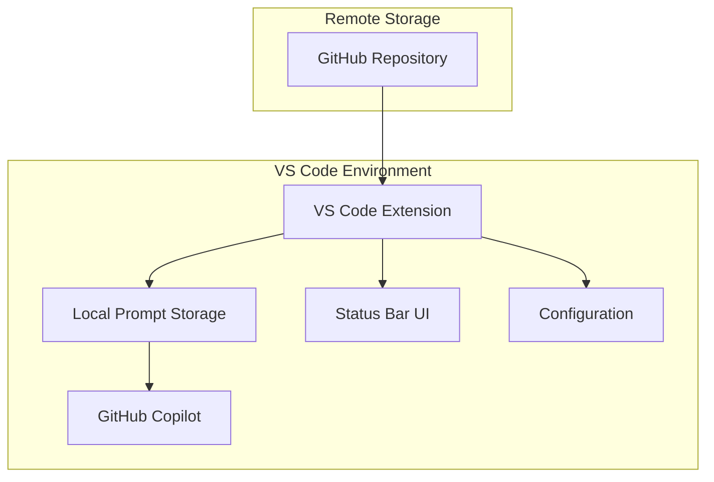
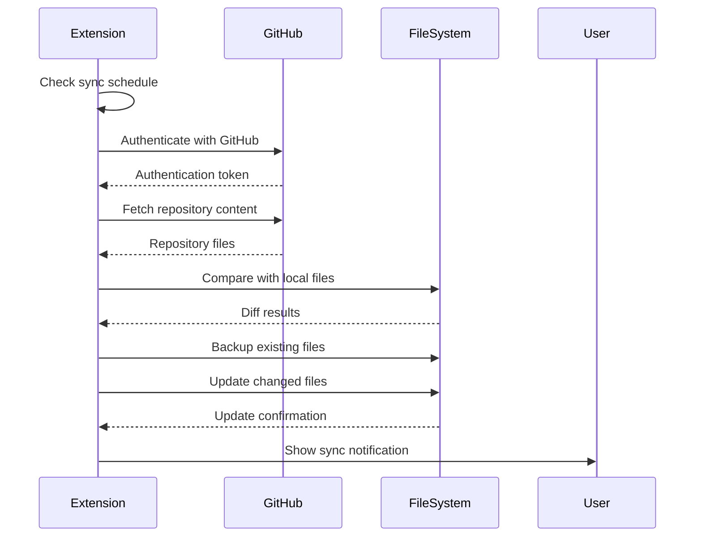

# Technical Architecture

> Comprehensive technical documentation for the Logient-Nventive Shared Prompt Bank system architecture, implementation details, and development guidelines.

## 🏗️ System Overview

The Logient-Nventive Shared Prompt Bank is a distributed system consisting of:

1. **Central Repository**: Git-based storage for prompts and instructions
2. **VS Code Extension**: Client-side synchronization and integration
3. **Local Prompt Storage**: User-specific prompt directories
4. **GitHub Integration**: Authentication and repository access



## 📦 Repository Architecture

### Directory Structure

```
prompts-logient-nventive/
├── prompts/                    # Synchronized prompt content
│   ├── instructions/          # Global coding guidelines
│   ├── prompt/               # Task-specific prompts
│   └── chatmode/             # Custom chat behaviors
├── docs/                      # Project documentation
├── tools/                     # Development tools
│   └── vscode-extension/     # VS Code extension source
├── scripts/                   # Automation scripts
└── README.md                  # Project overview
```

### Content Organization

**Prompts Directory (`/prompts/`)**

- Synchronized to user's VS Code prompts directory
- Organized by prompt type (instructions, prompt, chatmode)
- Subdirectories for categorization
- All files use Markdown with YAML frontmatter

**Documentation (`/docs/`)**

- User guides and technical documentation
- Not synchronized to local environments
- Maintained separately from prompt content

**Tools (`/tools/`)**

- VS Code extension source code
- Build and packaging scripts
- Development utilities

## 🔧 VS Code Extension Architecture

### Core Components

```typescript
// Extension entry point
extension.ts
├── activate()           // Extension initialization
├── deactivate()        // Cleanup on deactivation
└── command registration // VS Code command handlers

// Main management classes
SyncManager             // Orchestrates synchronization process
├── initialize()        // Setup sync schedules
├── syncNow()          // Manual sync trigger
├── scheduleSync()     // Automatic sync scheduling
└── handleErrors()     // Error handling and recovery

StatusBarManager       // UI status indication
├── updateStatus()     // Status display updates
├── showProgress()     // Progress indication
└── handleClick()      // User interaction

ConfigManager          // Settings management
├── getConfig()        // Read extension settings
├── validateConfig()   // Configuration validation
└── watchChanges()     // Settings change handling
```

### File System Operations

The extension performs several file system operations:

```typescript
// File system utilities (utils/fileSystem.ts)
interface FileSystemOperations {
  ensureDirectory(path: string): Promise<void>;
  copyFile(source: string, destination: string): Promise<void>;
  deleteFile(path: string): Promise<void>;
  listFiles(directory: string): Promise<string[]>;
  getFileStats(path: string): Promise<FileStats>;
}
```

**Key Operations:**

1. **Directory Detection**: Automatically find OS-specific prompts directory
2. **File Synchronization**: Compare and update local files with repository content
3. **Backup Management**: Create backups before overwriting local files
4. **Cleanup**: Remove outdated or deleted prompts

### GitHub Integration

```typescript
// GitHub utilities (utils/github.ts)
interface GitHubIntegration {
  authenticate(): Promise<GitHubAuth>;
  cloneRepository(url: string, branch: string): Promise<Repository>;
  pullChanges(): Promise<ChangeSet>;
  validateAccess(repository: string): Promise<boolean>;
}
```

**Authentication Flow:**

1. Use VS Code's built-in GitHub authentication
2. Validate repository access permissions
3. Handle authentication errors gracefully
4. Provide clear error messages for access issues

### Synchronization Process



**Sync Algorithm:**

1. **Trigger Check**: Determine if sync should run (schedule or manual)
2. **Authentication**: Verify GitHub access using VS Code's auth
3. **Repository Access**: Clone or pull latest repository content
4. **File Comparison**: Compare remote files with local prompts
5. **Backup Creation**: Save existing local files before changes
6. **File Updates**: Copy new/changed files to local prompts directory
7. **Cleanup**: Remove files that no longer exist in repository
8. **Notification**: Inform user of sync results

## ⚙️ Configuration System

### Extension Settings Schema

```json
{
  "promptsSync.enabled": {
    "type": "boolean",
    "default": true,
    "description": "Enable automatic prompts synchronization"
  },
  "promptsSync.frequency": {
    "type": "string",
    "enum": ["startup", "hourly", "daily", "weekly", "manual"],
    "default": "daily",
    "description": "Frequency of automatic sync"
  },
  "promptsSync.customPath": {
    "type": "string",
    "default": "",
    "description": "Custom prompts directory path"
  },
  "promptsSync.repository": {
    "type": "string",
    "default": "https://github.com/MounirAbdousNventive/prompts-logient-nventive",
    "description": "Repository URL to sync from"
  },
  "promptsSync.branch": {
    "type": "string",
    "default": "master",
    "description": "Repository branch to sync"
  },
  "promptsSync.syncOnStartup": {
    "type": "boolean",
    "default": true,
    "description": "Sync when VS Code starts"
  },
  "promptsSync.showNotifications": {
    "type": "boolean",
    "default": true,
    "description": "Show sync status notifications"
  },
  "promptsSync.debug": {
    "type": "boolean",
    "default": false,
    "description": "Enable debug logging"
  }
}
```

### Default Paths by Operating System

```typescript
const getDefaultPromptsPath = (): string => {
  const platform = process.platform;
  const homeDir = os.homedir();

  switch (platform) {
    case "darwin": // macOS
      return path.join(
        homeDir,
        "Library",
        "Application Support",
        "Code",
        "User",
        "prompts"
      );
    case "win32": // Windows
      return path.join(process.env.APPDATA!, "Code", "User", "prompts");
    case "linux": // Linux
      return path.join(homeDir, ".config", "Code", "User", "prompts");
    default:
      throw new Error(`Unsupported platform: ${platform}`);
  }
};
```

## 📝 Prompt File Format Specification

### YAML Frontmatter Schema

All prompt files use YAML frontmatter for metadata:

```yaml
# Common fields (all file types)
author: string              # Optional: Author name
lastUpdated: string         # Optional: ISO date string
version: string             # Optional: Semantic version

# Instructions-specific fields
applyTo: string             # Required: Glob pattern for file targeting
priority: number            # Optional: 1-10, higher = more important

# Prompt-specific fields
mode: 'agent'               # Required: Always 'agent' for prompts
category: string            # Optional: Organization category
difficulty: string          # Optional: beginner|intermediate|advanced
tags: string[]              # Optional: Searchable tags

# Chat mode-specific fields
description: string         # Required: Brief description
tools: string[]             # Optional: Available tools
category: string            # Optional: Organization category
```

### Content Structure

**Instructions (`*.instructions.md`):**

```markdown
---
applyTo: "**/*.{js,ts}"
priority: 5
---

# Instruction Title

## Context

When and why this applies

## Guidelines

Specific coding guidelines

## Examples

Code examples showing good/bad practices
```

**Prompts (`*.prompt.md`):**

```markdown
---
mode: agent
category: "development"
difficulty: "intermediate"
---

# Task Title

## Objective

Clear task description

## Instructions

Step-by-step process

## Success Criteria

Measurable outcomes
```

**Chat Modes (`*.chatmode.md`):**

```markdown
---
description: "Chat mode purpose"
tools: ["terminal", "files"]
---

# Mode Name

## Behavior Guidelines

How AI should behave

## Constraints

What to avoid

## Example Interactions

Sample conversations
```

## 🔄 Build and Deployment

### Extension Build Process

```bash
# Development setup
npm install                 # Install dependencies
npm run compile            # Compile TypeScript
npm run watch              # Watch mode for development

# Testing
npm run lint               # ESLint checking
npm run test               # Unit tests
npm run pretest            # Pre-test validation

# Production build
npm run package            # Create VSIX package
npm run vscode:prepublish  # Pre-publish preparation
```

### Packaging Configuration

```json
{
  "scripts": {
    "vscode:prepublish": "npm run compile",
    "compile": "tsc -p ./",
    "watch": "tsc -watch -p ./",
    "package": "vsce package",
    "lint": "eslint src --ext ts"
  },
  "engines": {
    "vscode": "^1.70.0"
  },
  "main": "./out/extension.js"
}
```

### Continuous Integration

Recommended CI/CD pipeline:

```yaml
# .github/workflows/extension-ci.yml
name: Extension CI
on: [push, pull_request]

jobs:
  build:
    runs-on: ubuntu-latest
    steps:
      - uses: actions/checkout@v3
      - uses: actions/setup-node@v3
        with:
          node-version: "18"

      - name: Install dependencies
        run: |
          cd tools/vscode-extension
          npm install

      - name: Lint code
        run: |
          cd tools/vscode-extension
          npm run lint

      - name: Compile TypeScript
        run: |
          cd tools/vscode-extension
          npm run compile

      - name: Run tests
        run: |
          cd tools/vscode-extension
          npm run test

      - name: Package extension
        run: |
          cd tools/vscode-extension
          npm run package

      - name: Upload artifact
        uses: actions/upload-artifact@v3
        with:
          name: extension-package
          path: tools/vscode-extension/*.vsix
```

## 🛡️ Security Considerations

### Authentication Security

- **GitHub Token Handling**: Use VS Code's secure token storage
- **Repository Access**: Validate permissions before operations
- **Token Refresh**: Handle expired tokens gracefully
- **Error Handling**: Avoid exposing sensitive information in logs

### File System Security

- **Path Validation**: Prevent directory traversal attacks
- **Permission Checks**: Verify write permissions before operations
- **Backup Strategy**: Always backup before overwriting files
- **Cleanup**: Secure deletion of temporary files

### Network Security

- **HTTPS Only**: All repository operations use HTTPS
- **Certificate Validation**: Verify SSL certificates
- **Timeout Handling**: Prevent hanging network operations
- **Rate Limiting**: Respect GitHub API rate limits

## 📊 Monitoring and Logging

### Logging Strategy

```typescript
interface Logger {
  info(message: string, data?: any): void;
  warn(message: string, data?: any): void;
  error(message: string, error?: Error): void;
  debug(message: string, data?: any): void;
}

// Usage patterns
logger.info("Sync started", { repository, branch });
logger.warn("File already exists", { filePath });
logger.error("Sync failed", syncError);
logger.debug("File comparison result", { changes });
```

**Log Categories:**

- **Sync Operations**: Start, progress, completion, errors
- **File Operations**: Create, update, delete, backup
- **Authentication**: Success, failure, token refresh
- **Configuration**: Changes, validation, errors
- **User Actions**: Manual sync, settings changes

### Performance Monitoring

**Key Metrics:**

- Sync operation duration
- File transfer speeds
- Error rates and types
- User interaction patterns
- Memory usage during operations

**Monitoring Implementation:**

```typescript
interface PerformanceMetrics {
  syncDuration: number;
  filesProcessed: number;
  bytesTransferred: number;
  errorCount: number;
  lastSyncTime: Date;
}
```

## 🔧 Development Guidelines

### Code Organization

```
src/
├── extension.ts           # Main extension entry point
├── syncManager.ts         # Core synchronization logic
├── statusBarManager.ts    # UI status management
├── configManager.ts       # Configuration handling
└── utils/
    ├── fileSystem.ts      # File system operations
    ├── github.ts          # GitHub API integration
    ├── logger.ts          # Logging utilities
    └── notifications.ts   # User notifications
```

### TypeScript Configuration

```json
{
  "compilerOptions": {
    "module": "commonjs",
    "target": "ES2020",
    "outDir": "out",
    "lib": ["ES2020"],
    "sourceMap": true,
    "rootDir": "src",
    "strict": true,
    "esModuleInterop": true,
    "skipLibCheck": true,
    "forceConsistentCasingInFileNames": true
  },
  "exclude": ["node_modules", ".vscode-test"]
}
```

### Testing Strategy

**Unit Tests:**

- Configuration management
- File system operations
- GitHub API integration
- Sync logic components

**Integration Tests:**

- End-to-end sync operations
- VS Code extension activation
- Error handling scenarios
- Cross-platform compatibility

**Manual Testing:**

- User experience flows
- Extension installation and setup
- Various sync scenarios
- Error recovery testing

### Error Handling Patterns

```typescript
// Standardized error handling
class SyncError extends Error {
  constructor(
    message: string,
    public readonly code: string,
    public readonly cause?: Error
  ) {
    super(message);
    this.name = "SyncError";
  }
}

// Error categories
enum SyncErrorCode {
  AUTHENTICATION_FAILED = "AUTH_FAILED",
  REPOSITORY_ACCESS_DENIED = "REPO_ACCESS_DENIED",
  FILE_SYSTEM_ERROR = "FS_ERROR",
  NETWORK_ERROR = "NETWORK_ERROR",
  CONFIGURATION_ERROR = "CONFIG_ERROR",
}

// Graceful error handling
try {
  await syncOperation();
} catch (error) {
  if (error instanceof SyncError) {
    await handleSyncError(error);
  } else {
    await handleUnexpectedError(error);
  }
}
```

## 🚀 Future Architecture Considerations

### Scalability Improvements

**Multi-Repository Support:**

- Support for multiple prompt repositories
- Repository prioritization and merging
- Team-specific prompt collections

**Performance Optimizations:**

- Incremental sync using git diff
- Compressed file transfers
- Background sync operations
- Smart caching strategies

**Enhanced Integration:**

- VS Code settings sync integration
- GitHub App for better authentication
- Webhook-based updates
- Real-time collaboration features

### Extension Architecture Evolution

**Modular Design:**

- Plugin system for custom sync sources
- Configurable prompt processors
- Extensible UI components
- API for third-party integrations

**Cloud Integration:**

- Azure DevOps integration
- Enterprise authentication providers
- Cloud-based prompt analytics
- Centralized configuration management

### Analytics and Insights

**Usage Analytics:**

- Prompt usage frequency
- Effectiveness metrics
- User behavior patterns
- Error pattern analysis

**Feedback System:**

- In-extension feedback collection
- Prompt rating and comments
- Automatic improvement suggestions
- Community-driven enhancements

## 📚 API Reference

### Extension Commands

```typescript
// Available VS Code commands
interface ExtensionCommands {
  "promptsSync.syncNow": () => Promise<void>;
  "promptsSync.showStatus": () => Promise<void>;
  "promptsSync.openSettings": () => Promise<void>;
  "promptsSync.resetConfiguration": () => Promise<void>;
}
```

### Configuration Events

```typescript
// Configuration change handling
interface ConfigurationEvents {
  onConfigurationChanged: (event: ConfigurationChangeEvent) => void;
  onSyncFrequencyChanged: (newFrequency: SyncFrequency) => void;
  onRepositoryChanged: (newRepository: string) => void;
}
```

### Status Events

```typescript
// Status change notifications
interface StatusEvents {
  onSyncStarted: (context: SyncContext) => void;
  onSyncProgress: (progress: SyncProgress) => void;
  onSyncCompleted: (result: SyncResult) => void;
  onSyncError: (error: SyncError) => void;
}
```

## 🔗 Related Documentation

- [Usage Guide](usage-guide.md) - How to use the prompt bank
- [Contribution Guide](contribution-guide.md) - How to contribute
- [Best Practices](best-practices.md) - Writing effective prompts
- [Installation Guide](installation-guide.md) - Setup instructions

---

**This technical architecture document is maintained by the DevOps team. For questions or suggestions, please create an issue in the repository.**
